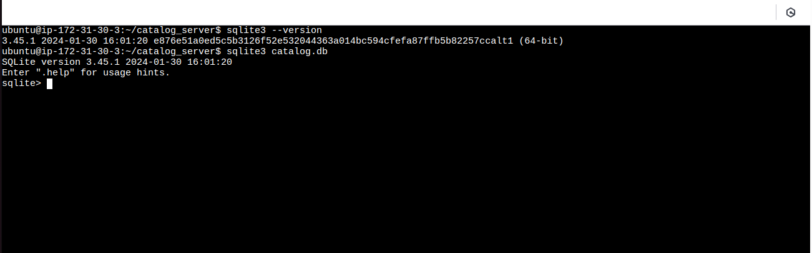
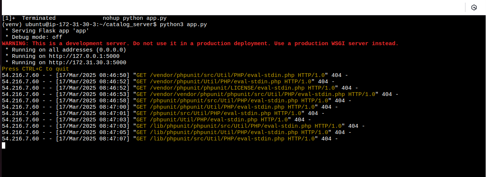
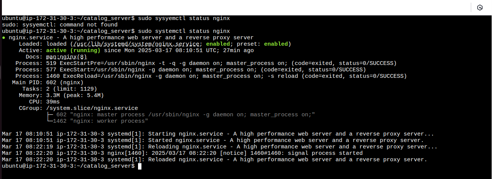
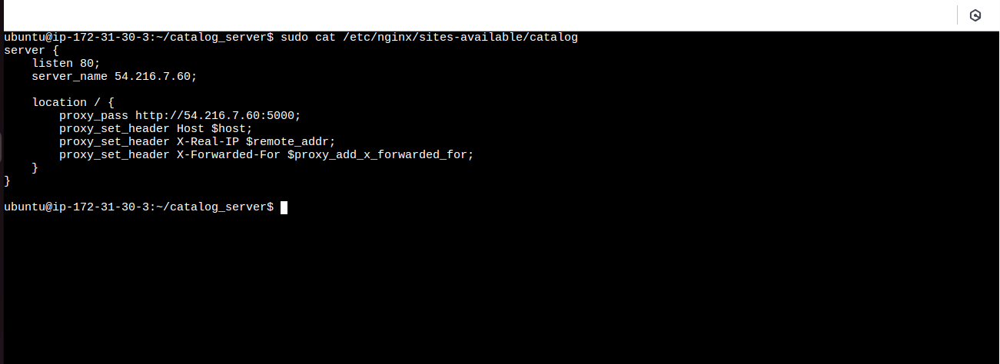
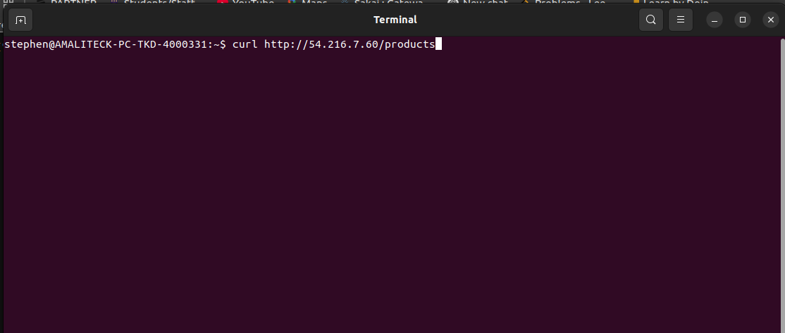
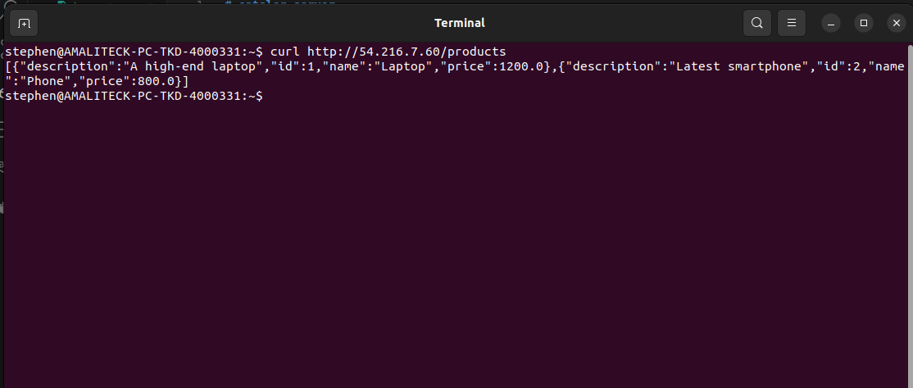

# Catalog Server

This project demonstrates how to set up a catalog server to store and serve metadata or product/service information using Flask, Nginx, and a database (SQLite/PostgreSQL/MySQL). The catalog data is exposed via a REST API.

## Features
- Serves catalog data via a Flask-based REST API
- Uses SQLite/PostgreSQL/MySQL for data storage
- Nginx as a reverse proxy for handling requests

## Prerequisites
Before running this project, ensure you have:
- A Linux server (Ubuntu/Debian recommended) with root or sudo access
- A working internet connection
- Basic familiarity with Linux, Nginx, and Python

## Install Required Packages
- Update system packages
```
    sudo apt update && sudo apt upgrade -y
```
- Install Nginx (Web Server)
```
    sudo apt install nginx -y
```
- Install Python and Required Dependencies
```
    sudo apt install python3 python3-pip python3-venv -y
```
- Install a Database (SQLite)
```
    sudo apt install sqlite3 -y
```
## Set Up the Catalog Database and Exit
```
    sqlite3 catalog.db
    .exit
```



## Clone the Repository
```
    git clone https://github.com/BINAH25/catalog-server.git
    cd catalog-server
```
## Set Up a Virtual Environment
```
    python3 -m venv venv
    source venv/bin/activate
```
## Install Dependencies
```
    pip install -r requirements.txt
```
## Start the Flask API Server
```
    python3 app.py
```


## Populate the Product table

```
    python3 populate_db.py app.py
```
## Set Up Nginx as a Reverse Proxy
- Create an Nginx configuration file
```
    sudo nano /etc/nginx/sites-available/catalog
```
- Add the following configuration
```
    server {
        listen 80;
        server_name 127.0.0.1; # replace 127.0.0.1 with your ip
        location / {
            proxy_pass http://127.0.0.1:5000;
            proxy_set_header Host $host;
            proxy_set_header X-Real-IP $remote_addr;
            proxy_set_header X-Forwarded-For $proxy_add_x_forwarded_for;
        }
    }
```
- Enable the configuration
```
    sudo ln -s /etc/nginx/sites-available/catalog /etc/nginx/sites-enabled/
    sudo nginx -t
    sudo systemctl reload nginx
```

- Check nginx Status to see if it is running
```
    sudo systemctl status nginx
```



## Run Flask as a Background
```
    nohup python app.py &
```
## Test the Catalog Server

```
    curl http://<your-server-ip>/products # curl http://54.216.7.60/products
```




## Lessons Learned

- Setting up a backend system: Learned how to integrate Flask with a database and expose REST APIs.
- Configuring Nginx as a reverse proxy: Improved knowledge of web server configurations and security.
- Database setup and management: Gained experience on how to connect SQLite with Flask and run migration.
- Running applications as background services: Learned to run the Flask apps in Background using nohup command.
- Security considerations: Understood the importance of securing APIs using  JWT token authentication

